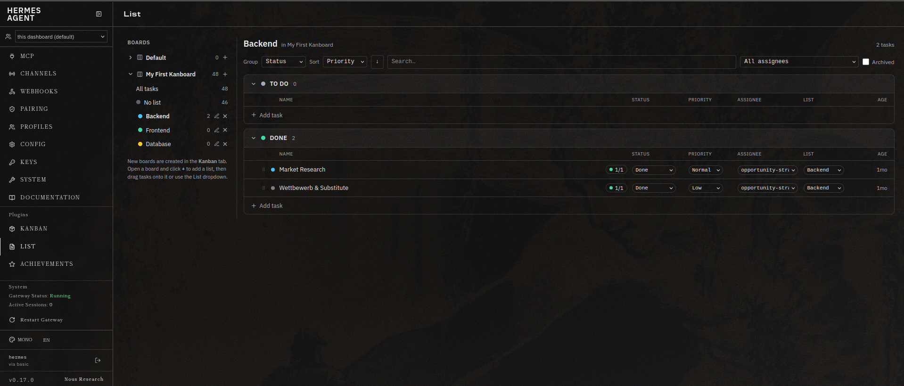
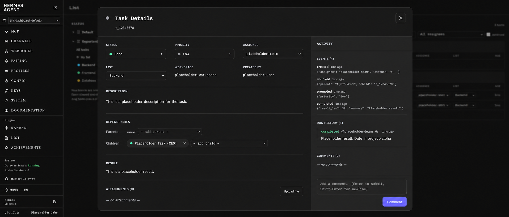
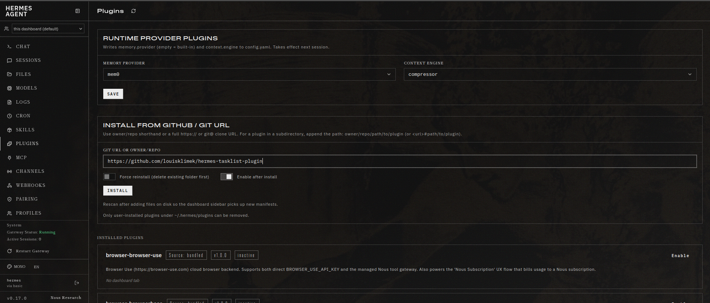

# Hermes TaskList — ClickUp‑style List View for the Hermes Agent Kanban Board

> A drop‑in dashboard plugin for **[Hermes Agent](https://github.com/NousResearch/hermes-agent)** that adds a fast, groupable **list view** on top of the built‑in multi‑agent Kanban board — inline editing, ClickUp‑style task detail popups, and live updates. No fork, no build step.

[](#license)
[](https://github.com/NousResearch/hermes-agent)
[](#development)



The stock Hermes Agent dashboard ships a Kanban board for its multi‑agent task system. It's great for dragging cards across columns, but it's *only* a board. **Hermes TaskList** gives you the other half of the picture: a dense, sortable, filterable **task list** that you can **group by status, assignee, priority, tenant, or project** — the way you'd work in ClickUp, Linear, or Asana — backed by the exact same task database. Switch between the board and the list whenever the view fits the job.

It's a pure dashboard UI plugin: it reads and writes the same `~/.hermes/kanban.db` through Hermes' existing `/api/plugins/kanban/*` REST API, so it stays perfectly in sync with the Kanban tab, the `hermes kanban` CLI, and the agent workers.

---

## Status colours (live from Kanban)

Status dot colours are read at runtime from the Kanban plugin's own stylesheet
(`/dashboard-plugins/kanban/dist/style.css`) via its `.hermes-kanban-dot-*` classes,
so the List and graph always match the board and **stay in sync automatically if the
Kanban colours are changed** later. The plugin loads that stylesheet if it isn't
already present and reads each status's colour from the live class; if the sheet is
unavailable it falls back to the current Kanban values (triage lilac, todo grey,
ready amber, running green, blocked red, done blue, archived grey).

## List & Dependency-graph views

A **List / Graph** switch in the header toggles between the normal list and a
**dependency-graph view** of parent/child links (persisted per browser).

Because a child can have **multiple parents** — and tasks have no start/end dates —
a classic time-axis Gantt doesn't fit. Instead the graph is a layered DAG: the
horizontal axis is *dependency order* (a child is placed strictly to the right of
all its parents), so it reads Gantt-like left → right as "this can only start once
its parents are done", while multiple incoming edges are shown cleanly. Each stage
column is labelled (Stage 1, 2, 3 …).

Each node shows its **one real status** — the dot and the label agree (both use the live Kanban colour/label), so there's never a “blocked dot but Ready text” contradiction. Dependency blocking is a separate signal: any task is *blocked* — either its status is `blocked`, or it's waiting on an unfinished parent — gets a **bold pulsing red outline** and a “waiting on a parent” note, so blockers stand out at a glance. **Jump between blocked tasks:** the legend shows ◀ Blocked k/n ▶ controls that smoothly pan+zoom the graph from one blocked task to the next. Click a node to open that task; hover to trace its full ancestor/descendant
chain (others dim). Navigate like an image editor: **scroll or pinch to zoom toward the cursor**, and **drag to pan** around the canvas; +/- buttons, a **Fit to screen** button (⛶) and a reset are also there, and the graph auto-frames itself when you open the view. Hold **Space** to pan from anywhere (Photoshop-style), which also suppresses task-opening clicks while held. On **touch devices** the same gestures work directly — **drag one finger to pan** and **pinch with two fingers to zoom** toward the pinch midpoint — so mobile no longer depends on the +/- buttons alone. Large graphs stay smooth because the SVG is memoised — panning and zooming only transform the viewport, they don't redraw the nodes. Entering the graph plays a
staggered entrance (nodes fade/scale in left → right, edges draw themselves in),
hovering flows animated dashes along the highlighted chain, ready nodes pulse
gently, and nodes lift on hover — all respecting `prefers-reduced-motion`. Cycles (which
shouldn't occur in a real dependency graph) are handled defensively without hanging.

## Features

- **Grouped list view** — inside any list, group tasks by **Status** (default, the kanban columns), **Assignee**, **Priority**, or nothing. Collapsible sections with task counts.
- **Subtask nesting** — parent tasks (those with kanban parent/child links) get a disclosure arrow; expand to see their child tasks nested underneath, at any depth. Children nest under their parent instead of cluttering the top level.
- **Boards → lists with drag & drop** — a ClickUp‑style left sidebar where every native Kanban **board** is a folder. Create named **lists** inside a board, click one to open it, **drag a task onto a list** (or use the per‑task List dropdown) to move it, and add tasks straight into a list with **+ Add task**. Lists are persistent and per‑board, stored by a tiny companion backend.
- **Sort & filter** — sort within each group by priority, created date, or title (asc/desc); full‑text search across title / id / body; filter by tenant and assignee; toggle archived tasks.
- **Inline editing** — change a task's **status**, **priority**, and **assignee** right from the row, without opening anything. Edits route through the same validated state machine the board uses.
- **Full task detail popup** — click any task to open a modal with the same capabilities as the native kanban drawer: editable title, status/priority/assignee/list, workspace and created‑by, an **editable description**, **dependencies** (add/remove parents & children), result, **attachments** (upload / download / delete), **comments** (read and post), the events log, the worker log (on demand), and run history.
- **Follow‑up from feedback** — tasks that are **Done** get a **Follow‑up** button (in the detail popup header *and* on the list row for quick access). It opens a small popup with a **Feedback** textarea, an **Assignee** selector (searchable list of every board profile, exactly like the New‑task popup, defaulting to the source task's own assignee) and a **Priority** selector (same Urgent / High / Normal / Low options and colors as the New‑task popup). On submit it auto‑creates a `Follow-up: …` card of type *Post‑Merge Feedback* with status **todo**, prefilled with the original task id and (when detected in the task body) the original pull‑request URL, assigned to the chosen profile, and **linked as a child of the original task** so the relationship is preserved.
- **Mobile‑friendly popups** — popups (task detail, New‑task, file preview) are sized for phones, and the phone's hardware/gesture **Back button just closes the topmost open popup** instead of navigating the dashboard away from the page. On mobile every **custom dropdown** (status / priority / assignee / list pickers, add‑parent/add‑child selectors — anywhere they appear, including directly on task rows, not just inside a popup) renders as a full‑size modal, so **Back closes an open dropdown first** wherever it was opened. Back keeps peeling layers — an open picker dropdown closes first so you stay in the task you were editing, then file preview → back‑stack, then the popup itself — until everything is closed, then behaves normally.
- **Live updates** — the list polls the board's append‑only event log and refreshes only when something actually changed; pauses automatically when the browser tab is hidden.
- **Multi‑board aware** — a board switcher appears automatically when you have more than one Kanban board.
- **Zero dependencies, zero build** — a single pre‑built IIFE bundle that uses the Hermes Plugin SDK. Drop the folder in and refresh.

## Screenshots

The **List** tab — native Kanban boards as folders in the sidebar, lists inside them, tasks grouped by status with inline status/priority/assignee/list editing and per‑list subtask counts:


The **task detail popup** — a near‑full‑screen, two‑pane view with the editable fields, description, dependencies, result and attachments on the left, and an **Activity** pane (events, run history, comments) on the right:



## Requirements

- A working **Hermes Agent** install with the **web dashboard** enabled (`hermes dashboard`).
- The bundled **Kanban** plugin enabled (this plugin reuses its API). If `hermes kanban init` has run and the Kanban tab shows up, you're good.
- A modern browser. No Node.js, npm, or build toolchain required to install.

Built and tested against Hermes Agent `main` (≈ v0.14.x). The plugin only relies on the documented, stable Plugin SDK (`window.__HERMES_PLUGIN_SDK__`) and the public kanban REST surface.

## Installation

### Easiest — install from the dashboard (no terminal)

Open the **Plugins** tab in the dashboard sidebar → **Install from GitHub / Git URL**, paste the repo and click **Install**:



```
https://github.com/LouisKlimek/Hermes-Tasklist-Plugin
```

(the shorthand `LouisKlimek/Hermes-Tasklist-Plugin` works too). Then **restart `hermes dashboard`** and hard‑refresh the browser (Ctrl+Shift+R). The **List** tab appears in the sidebar.

> A rescan is **not** enough: this plugin ships a backend (`plugin_api.py`), and plugin API routes are mounted only when the dashboard process starts. You must restart `hermes dashboard` after installing or updating.

- The repo root *is* the plugin (its `dashboard/manifest.json` sits at the top level), so the bare URL is enough. If you ever nest the plugin in a subfolder, append the path: `owner/repo#path/to/plugin`.

### Manual — clone or extract

```bash
# clone straight into the plugins directory
git clone https://github.com/LouisKlimek/Hermes-Tasklist-Plugin ~/.hermes/plugins/tasklist

# …or extract a release tarball
tar -xzf tasklist-plugin.tar.gz -C ~/.hermes/plugins/
```

Either way, the final layout must be:

```
~/.hermes/plugins/tasklist/
└── dashboard/
    ├── manifest.json
    ├── plugin_api.py        # custom-lists backend (mounted at /api/plugins/tasklist/)
    └── dist/
        └── index.js
```

Then **restart `hermes dashboard`** and hard‑refresh the browser.

> Plugin discovery is cached per dashboard process and, more importantly, the plugin's backend API routes only mount at startup — so a browser refresh or a rescan alone won't work. Restart the dashboard after installing or updating this plugin.

## Usage

- Open the **List** tab.
- Use the toolbar to pick how tasks are **grouped** and **sorted**, search, and filter by tenant/assignee.
- Edit a task's **status**, **priority**, or **assignee** directly in its row.
- **Click a task** to open the detail popup — it mirrors the native kanban drawer: edit the title (Enter or click‑away to save) and status/priority/assignee/list, edit the **description**, add/remove **parent & child dependencies**, upload/download/delete **attachments**, **post comments**, and read the events log, worker log, and run history. Close with the ✕, a click on the backdrop, or `Esc`.

### Boards & lists (the left sidebar)

The List tab has a left sidebar, like ClickUp — with your native Kanban **boards** as the top level:

- Each board is a collapsible folder. New boards are created the normal way in the **Kanban** tab; this sidebar simply lists them.
- Open a board and click its **+** to create a **list** inside it. Click a list to open it — the main area shows that list's tasks grouped by **status** (To Do, Done, … as collapsible sections). Empty status sections are hidden; **To Do** is always shown so you can quickly add tasks. Each board also has **All tasks** and **No list**.
- **Move a task into a list** two ways: drag the task row onto a list in the sidebar, or use the **List** dropdown on the task row (and in the detail popup). Drag a task onto **No list** to remove it. (Lists belong to a board, so tasks move between lists within the same board.)
- Inside an open list, each status section has a **+ Add task** row that creates a new task on that board in that list and status.
- **Subtasks**: a task that has kanban child links shows a ▸ arrow on the left of its title — click it to show/hide its children inline (the parent's `N/M` pill shows how many are done). Children appear nested under their parent rather than as separate rows. **Moving a parent into a list moves its subtasks with it** (via drag, the row List dropdown, or the popup).
- Click a list's name to **rename** it; the **✕** deletes it (the tasks stay on the board, they just leave the list).

## How it works

Hermes TaskList is a thin client over the existing kanban backend, plus a tiny companion backend for the custom‑lists feature:

```
┌────────────────────────────┐
│  List tab (React, this UI)  │  group / sort / filter / edit / drag&drop
└───────┬──────────────┬──────┘
        │              │  SDK.fetchJSON
        │              ▼
        │     ┌──────────────────────────┐   per-board lists + membership
        │     │ tasklist FastAPI (this)   │   /api/plugins/tasklist/*
        │     └────────────┬─────────────┘
        │                  ▼   $HERMES_HOME/tasklist/lists.db   (overlay, human-only)
        │  GET /board, /tasks/:id, /assignees, /boards
        │  PATCH /tasks/:id  (status / priority / assignee / title)
        ▼
┌────────────────────────────┐
│  Kanban plugin FastAPI API  │  /api/plugins/kanban/*   (unchanged, bundled)
└──────────────┬─────────────┘
               ▼
        ~/.hermes/kanban.db   (shared with the board, CLI, and workers)
```

Task edits go through the kanban API's validated `PATCH /tasks/:id` (so invalid status transitions surface a clear message instead of corrupting state). **Lists** live in a separate `lists.db` owned by this plugin and are a *human organizational overlay* — the core kanban, workers and the `hermes kanban` CLI don't see them. Membership is keyed by kanban task id and scoped per board. For **subtask nesting**, the plugin reads the kanban board's `task_links` table read-only (best-effort; if it can't, the list just renders flat).

Agents *can* opt into the lists, though — see below.

## Automatic sorting (zero‑config)

The plugin ships a second half that files tasks into lists **by itself** — no orchestrator wiring, no agent prompt changes, no provider keys. It's a Hermes *hook plugin* (`plugin.yaml` + `__init__.py` next to `dashboard/`) that registers the kanban lifecycle hooks `kanban_task_claimed` and `kanban_task_completed`. When a task first moves through the board it:

1. reads the task title/body straight from `kanban.db` (read‑only),
2. **if the task has a parent already filed in a list, it adopts the parent's list directly — no model call.** This is deterministic and is the reliable path for subtasks created automatically by AI via the API, which would otherwise default to **No list**. When a parent is filed, any of its still‑unsorted children (and their children, recursively) adopt the same list too — so a child claimed *before* its parent was sorted gets repaired the next time the parent moves through a hook.
3. otherwise reads the board's existing lists,
4. asks your **active model** via host‑owned `ctx.llm.complete_structured()` for the best‑fitting existing list — or a short new one if none fits,
5. writes the membership (creating the list if needed) into the same `lists.db` the dashboard reads.

Enable it once:

```bash
hermes plugins enable tasklist
```

After that, new tasks land in the right list (or a freshly‑created one) as they're claimed — the List view reflects it on its next poll.

Notes & honest caveats:

- **Children follow their parent for free.** Parent inheritance is a plain lookup against `task_links` + `lists.db` — no model call, no cost, fully deterministic. Only *parentless* tasks (or children whose parents aren't in any list) fall through to the LLM classifier. A task with **multiple parents** adopts the first parent (by link insertion order) that already has a list, so placement is reproducible.
- **No `created` hook exists in Hermes**, so the earliest signal is `claimed` — tasks are sorted when work *starts* on them, not the instant they're created. `completed` acts as a backstop. Because parent inheritance also propagates downward whenever a parent passes through a hook, an already‑placed parent fixes up its unsorted children on its next `claimed`/`completed` event.
- **Self‑heal for missed hooks.** The `claimed` hook fires in the **dispatcher** process (not the worker), so if this plugin wasn't active there for a fast task, that child could be left in **No list** even though its parent was already filed. To close that gap, **every** `claimed`/`completed` event now also runs a cheap, deterministic board‑wide reconciliation sweep: any still‑unsorted child whose parent already has a list is filed into it. So a missed child no longer stays stuck — the next hook on *any* task on the board repairs it. The sweep is pure `task_links` + `lists.db` lookups (no model call), respects manual placements, and is idempotent.
- It reuses existing lists by case‑insensitive name (never duplicates) and only creates a list when the model decides none fit.
- It's **best‑effort**: any failure (model unavailable in your build's worker‑hook context, db hiccup) is swallowed — it can never break a board transition. If `ctx.llm` isn't wired in that context on your Hermes version, auto‑sort simply no‑ops and the manual lists keep working. Parent inheritance still works even when `ctx.llm` is absent, since it never calls the model.
- **Cost**: at most one small structured model call per first‑seen *parentless* task. Children inheriting a parent's list cost nothing. On a busy board pin a cheap model under `plugins.entries.tasklist.llm.allowed_models` in `config.yaml`.

### Manual / explicit alternative — the CLI

If you'd rather have the orchestrator assign lists explicitly (or script it), the plugin also includes `dashboard/tasklist_cli.py`, which writes the same `lists.db` with **no session token**. Run it with the same `HERMES_HOME` as `hermes dashboard`:

```bash
# see existing lists on a board (reuse, don't duplicate)
python3 dashboard/tasklist_cli.py lists --board opportunity-discovery

# file a task into a list, creating it only if nothing fits
python3 dashboard/tasklist_cli.py assign \
    --board opportunity-discovery --task t_b1c00dbf --list "Backend" --create

# remove a task from any list
python3 dashboard/tasklist_cli.py unassign --board opportunity-discovery --task t_b1c00dbf
```

`assign` resolves `--list` by id then case‑insensitive name (so repeats reuse, not duplicate). `--board` is the board slug the dashboard uses (default board is `default`). This is handy as an escape hatch or for deterministic, rule‑based assignment from your own scripts; for hands‑off operation prefer the automatic hook above.


## Configuration

Everything lives in `dashboard/manifest.json`:

```json
{
  "name": "tasklist",
  "label": "List",
  "icon": "FileText",
  "tab": { "path": "/list", "position": "after:skills" },
  "entry": "dist/index.js",
  "api": "plugin_api.py"
}
```

- **`label`** — the tab name in the nav.
- **`icon`** — any [Lucide](https://lucide.dev) icon name supported by the dashboard.
- **`tab.position`** — `after:skills` is the safe default. Some Hermes builds also resolve `after:kanban` to place it next to the board; if your build doesn't, the tab falls back to the end of the nav.
- **`api`** — the custom‑lists backend (`plugin_api.py`). The dashboard mounts it at `/api/plugins/tasklist/` and it writes `$HERMES_HOME/tasklist/lists.db`. Remove this line if you don't want the lists feature; the rest of the view keeps working.

## Troubleshooting

**The List tab doesn't appear.**

1. **Check the path & structure.** `~/.hermes/plugins/tasklist/dashboard/manifest.json` and `.../dashboard/dist/index.js` must both exist, with no extra nesting (not `tasklist/tasklist/...`).
2. **Restart the dashboard.** The plugin's backend API routes (`/api/plugins/tasklist/*`) mount only when `hermes dashboard` starts — a browser refresh or a `/api/dashboard/plugins/rescan` won't load them. Fully restart the dashboard process after installing or updating. (A rescan only refreshes the frontend tab list, not Python routes.)
3. **Right user / home.** The dashboard scans the plugins directory of the user (and `HERMES_HOME`) it runs under. If it runs as a service under a different user, install into *that* user's `~/.hermes/plugins/`. Some installs scan the in‑repo plugins directory instead (e.g. `~/.hermes/hermes-agent/plugins/`); if the user dir doesn't work, try there.
4. **Inspect from the browser.** Open DevTools → Console and run
   `window.__HERMES_PLUGIN_SDK__.fetchJSON('/api/dashboard/plugins').then(console.log)`
   to see whether `tasklist` was discovered. Then check the Network tab for `dashboard-plugins/tasklist/dist/index.js` (a 404 means a path/`entry` mismatch).

**The tab loads but editing does nothing.** Status/priority/assignee edits use `SDK.fetchJSON(path, init)` with a `PATCH` request. If your Hermes build's `fetchJSON` doesn't forward the request options, edits won't persist (reads still work). Open an issue with your `hermes --version` and we'll adapt the bundle.

## Development

There is **no build step** — `dashboard/dist/index.js` is a plain IIFE that consumes globals from the Hermes Plugin SDK (`React`, `hooks`, `components`, `utils`, `fetchJSON`). To customize:

1. Edit `dashboard/dist/index.js` directly.
2. For frontend (`index.js`) changes, a rescan + hard‑refresh is enough. For backend (`plugin_api.py`) changes, **restart `hermes dashboard`** (API routes only mount at startup).

If you prefer a JSX + bundler workflow (esbuild / Vite / Rollup), build to a single IIFE file with React marked **external** (it comes from `SDK.React`) and emit it as `dashboard/dist/index.js`. See Hermes' [Extending the Dashboard](https://github.com/NousResearch/hermes-agent/blob/main/website/docs/user-guide/features/extending-the-dashboard.md) guide and the official [hermes-example-plugins](https://github.com/NousResearch/hermes-example-plugins) for the contract.

## Limitations & notes

- **Lists are a human overlay.** They live in this plugin's own `lists.db`, scoped per board, not in `kanban.db`, so agents, workers and the CLI don't see them. They're for organizing your own view. Boards themselves are the native Kanban boards.
- **Read/write parity for task fields.** TaskList exposes what the kanban API exposes for tasks (no custom due dates etc.). The list buckets are the one thing it adds on top.
- **`running` is not directly settable.** The backend reserves that transition for the dispatcher/claim path, so it's intentionally omitted from the status picker.
- **Polling, not WebSocket.** For drop‑in robustness the list polls the cheap board endpoint and diffs the event id rather than holding the authenticated WebSocket. It's light and pauses on hidden tabs.

## Roadmap

- Reorder lists by dragging their headers
- Saved views (persisted group/sort/filter presets)
- Optional WebSocket live stream instead of polling

Contributions welcome — see below.

## Contributing

Issues and pull requests are welcome. Please include your Hermes Agent version (`hermes --version`) and, for UI issues, a screenshot plus any relevant browser console output.

## License

[MIT](LICENSE) — same license as Hermes Agent and the official example plugins. You'll want to add a `LICENSE` file with your name and the current year before publishing.

## Related & acknowledgements

- [Hermes Agent](https://github.com/NousResearch/hermes-agent) by Nous Research — the agent framework and the bundled Kanban board this plugin builds on.
- [Extending the Dashboard](https://github.com/NousResearch/hermes-agent/blob/main/website/docs/user-guide/features/extending-the-dashboard.md) — the Plugin SDK reference.
- [hermes-example-plugins](https://github.com/NousResearch/hermes-example-plugins) — reference implementations of dashboard plugins.

---

<sub>Keywords: Hermes Agent dashboard plugin · multi‑agent kanban board · ClickUp‑style list view · agent task management UI · Nous Research Hermes · kanban list view plugin · self‑hosted AI agent orchestration.</sub>

## File Explorer integration

Clickable file paths in task descriptions, results, run summaries and comments
open in a built-in mini viewer (Markdown/image/text, with in-file path
navigation and a Back button).

**Paths are only turned into links when the file or folder actually exists.**
Before rendering a link, the plugin verifies the target — first by a direct
lookup (listing the parent directory), and if that misses (agents often write
paths with a missing prefix) by a bounded search of the file tree. Text that
merely contains slashes (e.g. `ToS/robots.txt`, `Normalisierungs-/Dedupe-/…`,
`WDR/mitvergnuegen/Stadtmarketing`) stays plain text. Each text→link decision is
**cached** per candidate, so the same path isn't re-checked on every render;
unresolved candidates still trigger the detailed search once. The lookup runs with high concurrency, and every resolved path is **cached server-side in this plugin's own SQLite DB** (`$HERMES_HOME/tasklist/lists.db`, table `path_cache`, via `/api/plugins/tasklist/pathcache`). So an expensive tree search runs at most once across **all** browsers, devices and page reloads — a path resolved once shows up as a link instantly next time, without re-searching. The cache is self-contained (this plugin never reads another plugin's data) and falls back to browser `localStorage` if the backend isn't reachable. Positive results are kept 7 days, negatives 1 hour; `DELETE /api/plugins/tasklist/pathcache` clears it. If the **File Explorer** plugin is also installed, on load this plugin *additionally* reads that plugin's cache (`/api/plugins/fileexplorer/pathcache`, best-effort, read-only) and reuses any paths it already resolved — so a search done in either plugin speeds up both. It still never writes to the other's DB, so the two remain fully independent.

**Background pre-warming (server-side).** File/folder paths mentioned in tickets
are pre-resolved into the cache by the plugin **backend**, not the browser. The
backend reads ticket text straight from ``kanban.db`` and resolves each path
against an in-memory index of the files root (``/opt/data`` by default, override
with ``HERMES_FILES_ROOT``) — no ``/api/files`` tree-walking in the client at all.
While the List page is open the browser just calls ``POST /warm`` every few
minutes and merges the freshly-resolved cache, so opening a ticket shows its links
instantly. There is also ``POST /pathresolve`` for resolving a few candidates on
demand. Because the resolution runs directly on disk it's effectively free
compared with the old per-candidate HTTP walk.

If the companion
[Better Hermes File Explorer](https://github.com/LouisKlimek/Better-Hermes-File-Explorer)
plugin is installed, the tasklist **detects it automatically** and instead
deep-links paths straight into the Explorer — files via `…/file-explorer?file=<path>`
and **folders** via `…/file-explorer?path=<dir>` (folder paths only become clickable
when the Explorer is present). No configuration needed; without the Explorer the
built-in viewer is used.

- **Create lists inline from a task.** The List dropdown in a task's detail popup lets you type a new list name and create it on the spot; the task is assigned to the new list immediately.

- **Archive with confirmation + an Archived view.** Archiving a task from its detail popup now asks for confirmation first (unarchiving stays one click). A dedicated **Archived** entry in each board's sidebar lists archived tasks; open one to unarchive it, or drag a task onto Archived to archive it.
